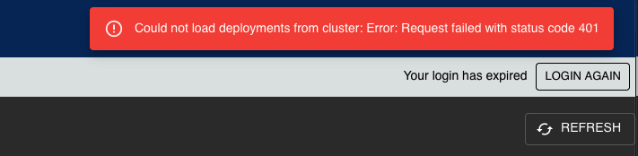

# Pluto Headers

Pluto-headers is a library that contains UI components re-used across multiple Pluto services, most notably the
header and menu bars and the login code.

**Help! I installed it locally and it broke my dev environment!** - see the section "Local Development" below.
Or if you are very impatient, try:

```bash
rm -rf node_modules/pluto-headers/node_modules 
```


## Header
The "Header" is the static blue bar that sits across the top of all the pluto
components and looks like this:


Usage: 
```jsx
  <Header/>
```

## AppSwitcher
The "AppSwitcher" is the menu bar which also provides log-in/log-out functionality:


The actual content from the menus is loaded from a file which is expected to be presented at
`/meta/menu-config/menu.json`.

This is provided by the pluto-start component and is over-ridden by runtime configuration in the 
actual deployment.

It's expected to take the form of an array of objects, like this:

```json
[
  {
    "type": "{link|submenu}",
    "text": "Presented text",
    "href": "https://link.location [only for the 'link'] type",
    "content": [
      //[only for the 'submenu' type]
      {
        "type": "link",
        "text": "Presented text",
        "href": "https://link.location"
      }
    ]
  }
]
```

The app switcher also loads in oauth configuration for the purpose of initiating
the oauth login flow by sending the user to the IdP when you click the 'login" button.

It supports callbacks to notify a parent of login/logout events

Usage:
```jsx 
  <AppSwitcher
    onLoggedIn={()=>alert("user logged in")}
    onLoggedOut={()=>alert("user logged out")}
    onLoginValid={(valid, jwtDataShape)=>alert(`login ${valid ? "was" : "was not"} valid. User profile data: ${jwtDataShape}`)}
  />
```


## Breadcrumb


The breadcrumb is a commission -> project -> master trail that is used at the top of pluto-core and
pluto-deliverables pages to allow the user to directly jump to parent objects, even across apps.

It performs REST requests to the relevant (pluto-core or pluto-deliverables) backend in order to
determine the presentable information for a given deliverable or project.  If the backend is not
available, then a warning is displayed.

The images and styles are bundled in, so you don't have to worry about including them in a specific place.

Usage:
```jsx
  <Breadcrumb
    masterId={optionalMasterIdNumber}
    projectId={optionalProjectIdNumber}
    commissionId={optionalCommissionIdNumber}
   />
```

The optional `plutoCoreBaseUri` parameter allows you to override the relative base url of 
pluto-core from the default value `/pluto-core`. It's not expected to be of any use in the "real world".

## SystemNotification


The SystemNotification component is a popup message notification that can be used in all frontend services.
You need to put the `<SystemNotification>` component into your root page, and then you can "open" the notification
from any code, including callbacks.

There are four severity states: 
- SystemNotifcationKind.Success
- SystemNotifcationKind.Error
- SystemNotifcationKind.Info
- SystemNotifcationKind.Warning

Each of these uses the background colour associated with the given state in the theme.  Default values are green, red,
blue and orange respectively.  For this reason, you should make sure that `<SystemNotification/>` goes inside 
`<ThemeProvider></ThemeProvider>`.

Each is also automatically provided with a suitable icon by the `<Alert>` component

**Usage example**:

index.[tj]sx:

```jsx
import {SystemNotification} from "pluto-headers";
import {ThemeProvider} from "@material-ui/styles";

render()
{
  <ThemeProvider>
    <etc/>
    <SystemNotification/>
    <RestOfYourStuff/>
  </ThemeProvider>
}
```

somecomponent.tsx:
```jsx
import {SystemNotifcationKind, SystemNotification} from "pluto-headers";

fetch("some-resource")
  .then(()=>SystemNotification.open(SystemNotifcationKind.Success, "Loaded content"))
  .catch((err)=>SystemNotification.open(SystemNotifcationKind.Warning, `Could not load content: ${err.toString()}`))
```

This will show a green message if the content loads OK or an orange one if it does not, with the given text.

The message should auto-close in 3 seconds.

## UserContext

UserContext is a React context provider that can be used to make user login details available to arbitary componets without resorting
to "prop drilling".  (For more information about Contexts in react, see https://reactjs.org/docs/context.html)

In order to use it, you must position the "provider" as a parent component high-up in the tree; normally this meens
putting it into your root component.

In order to _populate_ it, however, you need to have a local state var to hold the current user profile information
and you need to set/unset it in response to login and logout events.

This can be done via the callbacks available from `<AppSwitcher>`.

Here is an example of how to use it:

index.tsx:

```typescript jsx
import React, {useState} from "react";
import {UserContext, UserContextProvider, Header, AppSwitcher, JwtDataShape} from "pluto-headers";
import {ThemeProvider} from "@material-ui/styles";
import {CssBaseline} from "@material-ui/core";

const indexComponent = () => {
  const [userProfile, setUserProfile] = useState < JwtDataShape|undefined >(undefined);
  
  const setLogin = (isValid: boolean, profile: JwtDataShape) => {
      if(isValid) {
          setUserProfile(profile);
      } else {
          setUserProfile(undefined);
      }
  }
  
  return (
          <div style={{width: "100vw", height: "100vh", overflow: "hidden"}}>
            <ThemeProvider theme={theme}>
              <CssBaseline/>
              <Header/>
              <AppSwitcher onLoginValid={setLogin}/>
              <UserContextProvider value={{
                  profile: userProfile,
                  updateProfile: (newValue) => setUserProfile(newValue)
              }}>
                /*now comes your normal routing stuff - Switch, Route etc.*/
                      <Switch>
                              <Route></Route>
                      </Switch>
              </UserContextProvider>
            </ThemeProvider>
          </div>
  )
}
```

Now, with the setup above the contents of the `userProfile` state variable at the top level is available to _any_
component that lives anywhere in the DOM tree below `<UserContextProvider>` (in this example, in any subcomponent that
is availbel via react-router).  This is most convenient through a hook in a functional component, like so:

examplecomponent.tsx:

```typescript jsx
import {useContext} from "react";
import {UserContext} from "pluto-headers";
import {Typography} from "@material-ui/core";

const exampleComponent = () => {
  const userContext = useContext(UserContext);

  return (
          <Typography>
            {
              userContext ? `You are ${userContext.profile.username}` : "You are not logged in"
            }
          </Typography>
  )
}
```

But you can also use context in a class-based component

classbased.jsx:

```jsx
import React from "react";
import {UserContext} from "pluto-headers";
import {Typography} from "@material-ui/core";

class ExampleClassComponent extends React.Component {
    static contextType = UserContext;
    
    render() {
        return (
            <Typography>
              {
                this.context ? `You are ${this.context.profile.username}` : "You are not logged in"
              }
            </Typography>
        )
    }
}
```

As you can see from the `index.tsx` sample above, the `profile` property of the context object is a `JwtDataShape`, which is defined in
`utils/DecodedProfile.ts` - you can see the user profile information available there.

## OAuthContext

OAuthContext is a context provider like UserContext which provides details of the OAuth configuration.  This is needed
if you want to have a login button in your app.  It's only useful for pluto-start and AppSwitcher, really.

## Utilities

### Interceptor

This provides an axios "interceptor" (callback placed in the response chain) which will
automatically attempt to refresh the login token if a "permission denied" is received.

### OAuth2Helper

This provides the code necessary to request a token refresh using a provided "refresh token".

### OAuthConfiguration

This provides the interface prototypes for the json configuration that allows us to contact an oauth provider.
It also provides the 'ti-interface-checker' generated code that allows us to verify correct data shape
at runtime.

### DecodedProfile

This provides the interface prototype for the JWT-based user profile along with a proxy that simplifies
finding data.

### JwtHelpers

This provides utility code that downloads the signing key, verifies the provided key
and decodes the user profile.

# React component library

Since this is a react component library with dependencies such as react and material ui, it is required 
that these are used as peerDependencies, otherwise these would collide with the external applications 
dependencies that is using this react component library.

# Local development

In order to test updates to the library "in-situ" (i.e. in a real app in the browser) you need to link it into
an app locally (referred to here as the "host project"), rebuild the host project and then redeploy it.

If the UI refuses to load and you see an error about "breaking the rules of hooks",  then pay special attention
to step 4.

- Build the library

  ```
  yarn && yarn build
  ```

- In host project's package.json, update pluto-headers dependency by adding a relative path to the root

  ```
  "pluto-headers": "file:<relative-path-to-pluto-headers-root>"
  ```

- In external repository, install the added dependency
  ```
  yarn
  ```

- In external repository, find the `node_modules` directory for pluto-headers that was copied, and delete it:
   ```
   rm -rf node_modules/pluto-headers/node_modules
   ```
  This removes extraneous copies of react, material-ui etc. which otherwise conflict with the component you were testing.

  If, when you load your built service, you see a blank screen and a console error complaining about **"Not following the rules of hooks"**,
  then you need to double-check that you have performed this step.
  
  The `node_modules` directory is ignored for git, so when you install via the git repo you don't get it and the library
  falls back to using the dependent libraries that are installed by the host project.
  
  When you install from your local "file:", you _do_ have `node_modules` and where it contains react, react-dom, material-ui
  etc. these conflict with the host project's own ones and result in the "hooks" error.  Simply deleting them out brings
  the installation back into line with how it should work.
  
  See https://www.claritician.com/how-to-create-a-local-react-typescript-library-that-i-can-use-across-my-react-projects
  for more information - it recommends putting the `rm -rf` in a "postinstall" script but if you do this it deletes
  the whole node_modules folder immediately after the `yarn install` has created it, so you can't test or build.


- Once you have removed the extraneous node_modules, Build the host project you are testing with:
   ```
   yarn dev
   sbt docker:publishLocal or docker build . -t guardianmultimedia/... or other thing to build the package
   ```
  
   Then deploy it to your prexit-local environment by checking that you are asking for the correct container version
   and deleting the current pod.
  

- Now, you're going to want to make some changes to the library and test them; so you go back to the start and follow the
  instructions again. But, when you run step two above,  you'll see that nothing gets installed.  This is because the
  `yarn install` you ran updates the `yarn.lock` file and `yarn` thinks that since the library version is the same it
  does not need installing.
  
  While you _could_ change the version number every single time, I find it easier to manually go into the `yarn.lock`
  file each time I want to test the library and remove the `pluto-headers` block, then save.
  
  `yarn` or `yarn install` will then re-copy the library with the new updates you have made, and you need to remove the
  extraneous `node_modules` directory again and rebuild the host project frontend before the host project frontend will 
  run properly.
  

# Build and publish

- Build

  ```
  yarn && yarn build
  ```

- Publish
  - Commit the changes
  - Create a new version
    ```
    yarn version
    ```
  - Push the changes
    ```
    git push --follow-tags
    ```

# Update the other components that use this library

A number of the prexit components use this library, and manually updating them all can be a drag.  To simplify this,
a script is provided that can patch the package.json file and open a merge request on each component.

You'll need python3 installed to run it.

```bash
cd scripts
./rollout_updated_version.py --help
./rollout_updated_version.py --token {gitlab-token} --all-my-repos
```

In order to run it, you'll need to create a gitlab API token under your username.  You can go this by going to your avatar
at the top-right of the Gitlab window, selecting **Preferences** from the dropdown menu and then going to **Access Tokens**
on the left-hand side of the screen.

Create a name for the access token and tick "API" under "Scopes".

Copy the presented string and save it somewhere secure (DON'T put it into this repo!!!!)

You can then run the script, as above, which will:
- iterate all of the Github projects you 'own'
- try to find a package.json file in each of them
- if a package.json file is found, download the current master version and try to find "pluto-headers" under "dependencies"
- if found, parse the git string and extract the version number and compare it to the version specified in the local package.json
for pluto-headers.
- if they don't match, create a branch, update the package.json in the remote project to the version of pluto-headers that
the script is running from, commit that and create a merge request.
- if the project does not have 'package.json', or it doesn't import pluto-headers, etc., it will be left alone.
